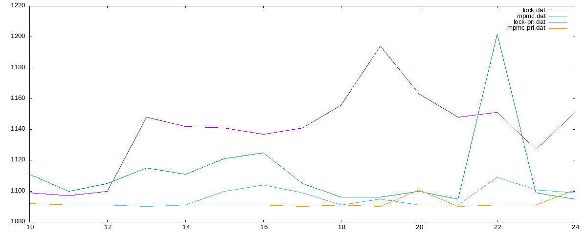
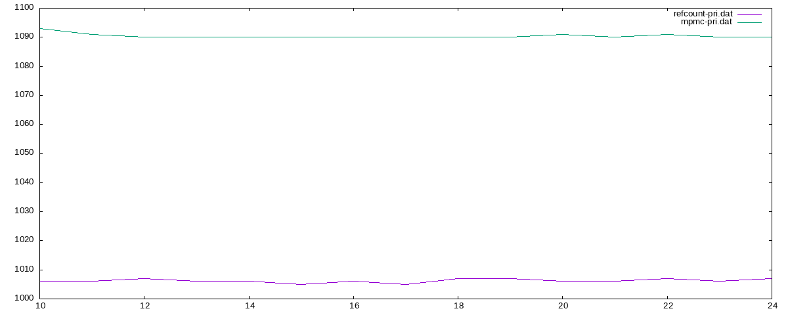

# lock-free-sandbox

Benchmarks for some lock-free data structures based on [C++ lectures in Russian](https://sourceforge.net/projects/cpp-lects-rus/) and [C++ Concurrency in Action](https://www.amazon.com/C-Concurrency-Action-Practical-Multithreading/dp/1933988770) book.

## Results

### Set priority and nice parameters

### Comparison between lock-free stack and queue

## References

1. [C++ lectures in Russian](https://sourceforge.net/projects/cpp-lects-rus/) ([youtube playlist](https://www.youtube.com/playlist?list=PL3BR09unfgcgJPQZKaacwzGmcXMtEA-19))
2. [C++ Concurrency in Action](https://www.amazon.com/C-Concurrency-Action-Practical-Multithreading/dp/1933988770) ([anthonywilliams/ccia_code_samples](https://github.com/anthonywilliams/ccia_code_samples/), [subjam/concurrency-in-action](https://github.com/subjam/concurrency-in-action))
3. [Bounded MPMC queue](http://www.1024cores.net/home/lock-free-algorithms/queues/bounded-mpmc-queue) by Dimitry Zhukov
